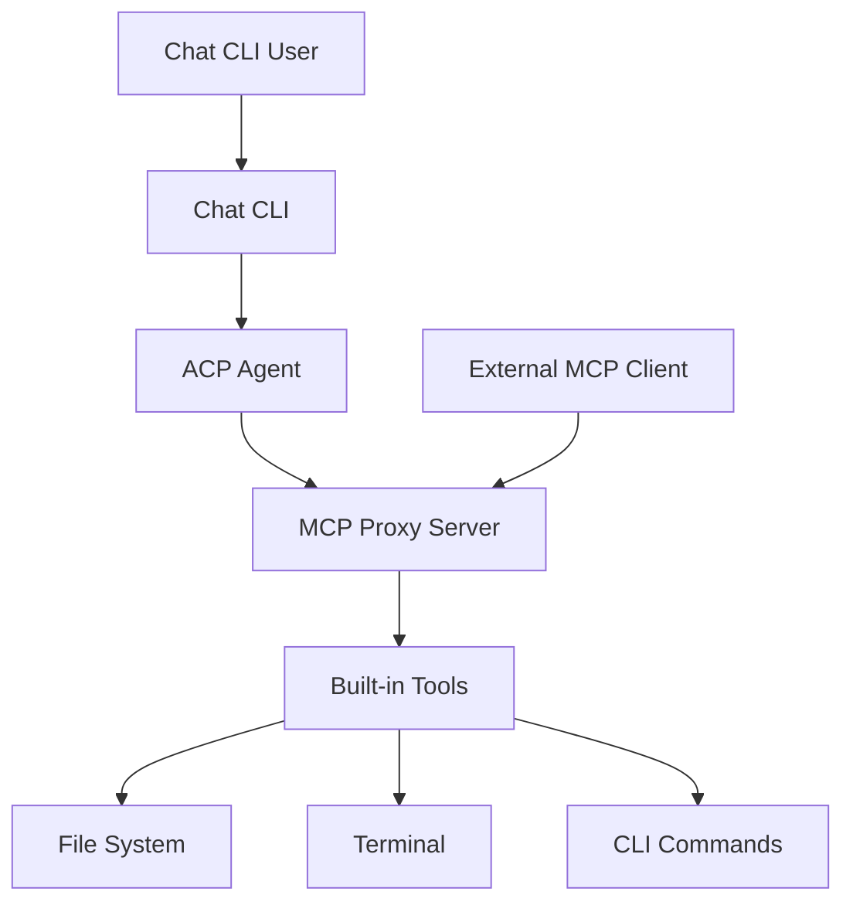
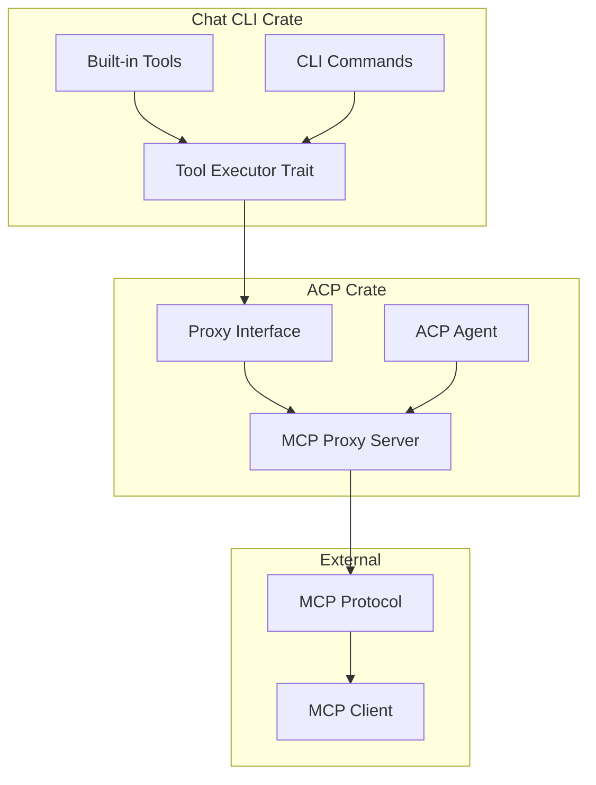

# System Scope and Context

## Business Context

## Technical Context

## Interfaces

| Interface | Partner | Input | Output |
|-----------|---------|-------|--------|
| **Tool Executor** | Chat CLI | Tool name, parameters | Tool result |
| **MCP Server** | External clients | MCP requests | MCP responses |
| **Proxy Interface** | ACP Agent | Tool execution requests | Proxied results |
