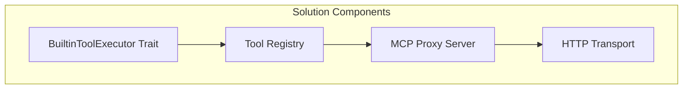

# Solution Strategy

## Technology Decisions

| Decision | Rationale |
|----------|-----------|
| **Trait-based Interface** | Enables dependency injection without direct crate coupling |
| **Internal MCP Server** | Reuses existing MCP infrastructure, standard protocol |
| **HTTP Transport** | Simple, well-supported, matches Claude Code ACP pattern |
| **Conditional Registration** | Only expose tools that are actually available |

## Top-level Decomposition

## Quality Achievement

| Quality Goal | Approach |
|-------------|----------|
| **Protocol Compatibility** | Use standard MCP server implementation |
| **Performance** | Direct delegation, minimal serialization overhead |
| **Maintainability** | Clear trait boundaries, single responsibility |

## Key Patterns

1. **Proxy Pattern**: MCP server proxies to built-in tools
2. **Dependency Injection**: Chat CLI provides tool executor implementation
3. **Conditional Registration**: Tools registered based on capabilities
4. **Error Translation**: Convert between error types transparently
