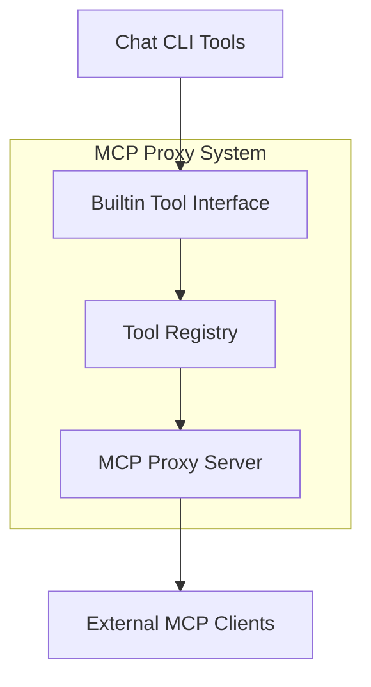

# Building Block View

## Level 1: System Overview



## Level 2: Component Details

### MCP Proxy Server
- **Responsibility**: HTTP MCP server implementation
- **Interface**: Standard MCP protocol endpoints
- **Implementation**: Rust MCP server library

### Builtin Tool Interface
```rust
pub trait BuiltinToolExecutor: Send + Sync {
    async fn execute_tool(&self, tool: &str, params: Value) -> Result<String, Error>;
    async fn execute_command(&self, command: &str, args: Vec<String>) -> Result<String, Error>;
    async fn get_capabilities(&self) -> ToolCapabilities;
}
```

### Tool Registry
- **Responsibility**: Map MCP tool calls to builtin implementations
- **Key Functions**:
  - Register available tools based on capabilities
  - Route tool calls to appropriate handlers
  - Handle error translation

## Level 3: Implementation Components

### Tool Handlers
```rust
// File operations
async fn handle_fs_read(params: Value) -> McpResult;
async fn handle_fs_write(params: Value) -> McpResult;

// Terminal operations  
async fn handle_execute_bash(params: Value) -> McpResult;

// CLI commands
async fn handle_compact_command(params: Value) -> McpResult;
```

### Error Translation
```rust
pub enum ProxyError {
    ToolNotFound(String),
    ExecutionFailed(String),
    InvalidParameters(String),
    McpError(McpError),
}
```
