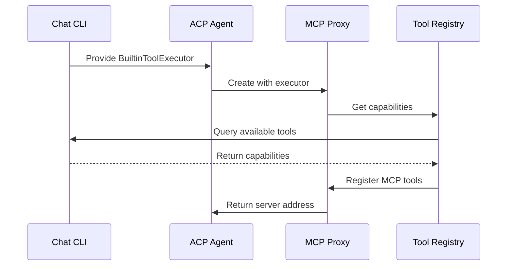
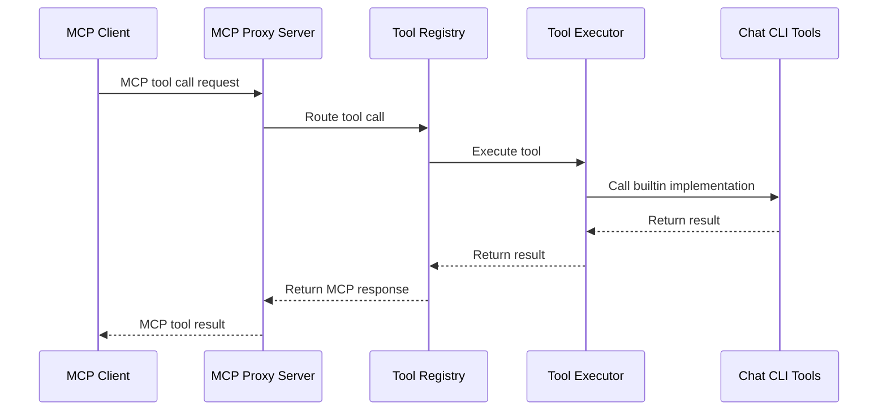
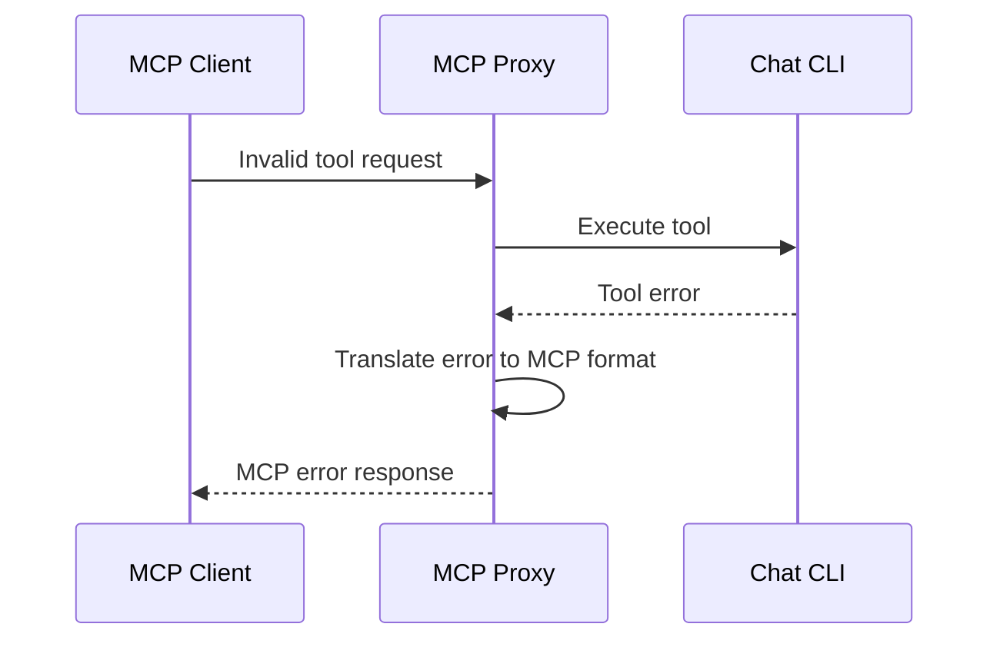

# Runtime View

## Scenario 1: Tool Registration

## Scenario 2: Tool Execution

## Scenario 3: Error Handling

## Performance Considerations

- **Connection Pooling**: Reuse HTTP connections
- **Async Processing**: Non-blocking tool execution
- **Error Caching**: Cache tool availability checks
- **Minimal Serialization**: Direct parameter passing where possible
