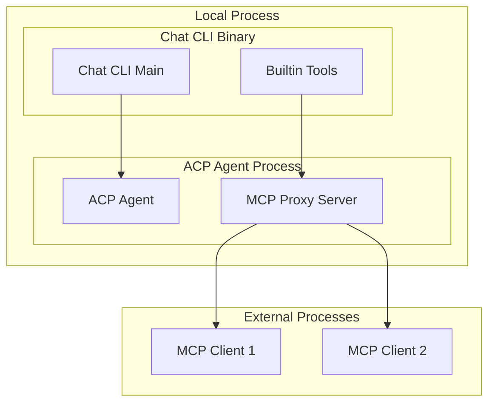

# Deployment View

## Infrastructure Overview



## Network Configuration

| Component | Protocol | Port | Binding |
|-----------|----------|------|---------|
| **MCP Proxy Server** | HTTP | Dynamic (0) | 127.0.0.1 |
| **Tool Executor** | In-process | N/A | Direct calls |

## Process Model

### Single Process Deployment
- Chat CLI and ACP Agent in same process
- MCP Proxy as embedded HTTP server
- Direct trait-based communication

### Multi-Process Deployment (Future)
- Chat CLI as separate service
- ACP Agent connects via IPC/HTTP
- MCP Proxy bridges protocols

## Security Considerations

| Aspect | Implementation |
|--------|---------------|
| **Network Binding** | Localhost only (127.0.0.1) |
| **Authentication** | Session-based via headers |
| **Tool Permissions** | Inherited from chat CLI permissions |
| **Process Isolation** | Same process for direct access |

## Configuration

```rust
pub struct ProxyConfig {
    pub bind_address: String,        // "127.0.0.1"
    pub port: u16,                   // 0 for dynamic
    pub session_timeout: Duration,   // Tool execution timeout
    pub max_connections: usize,      // Concurrent MCP clients
}
```
