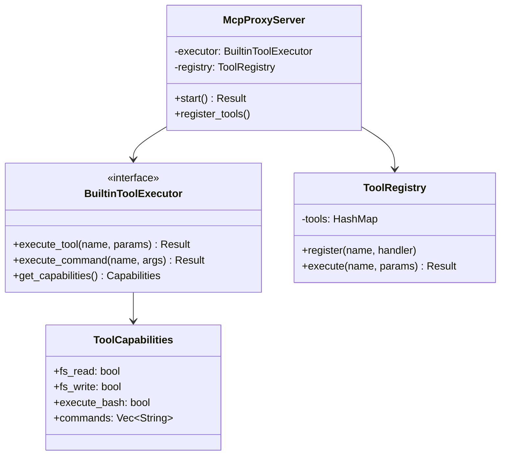

# Cross-cutting Concepts

## Domain Model



## Error Handling Strategy

### Error Categories
1. **Tool Not Found**: Unknown tool name
2. **Invalid Parameters**: Malformed input
3. **Execution Failed**: Tool execution error
4. **Permission Denied**: Access control failure

### Error Translation
```rust
impl From<ToolError> for McpError {
    fn from(err: ToolError) -> Self {
        match err {
            ToolError::NotFound(name) => McpError::MethodNotFound(name),
            ToolError::InvalidParams(msg) => McpError::InvalidParams(msg),
            ToolError::ExecutionFailed(msg) => McpError::InternalError(msg),
            ToolError::PermissionDenied => McpError::InvalidRequest("Permission denied".into()),
        }
    }
}
```

## Logging and Monitoring

### Log Levels
- **ERROR**: Tool execution failures, MCP protocol errors
- **WARN**: Tool not found, invalid parameters
- **INFO**: Tool registration, server startup/shutdown
- **DEBUG**: Tool execution details, parameter values
- **TRACE**: MCP protocol messages

### Metrics
- Tool execution count by name
- Tool execution duration
- Error rate by tool
- Active MCP connections

## Security Concepts

### Access Control
- Tools inherit chat CLI permissions
- Session-based isolation
- No cross-session access

### Input Validation
- Parameter schema validation
- Path traversal prevention
- Command injection protection

## Configuration Management

### Tool Configuration
```rust
pub struct ToolConfig {
    pub enabled_tools: Vec<String>,
    pub disabled_tools: Vec<String>,
    pub tool_settings: HashMap<String, Value>,
}
```

### Runtime Configuration
- Dynamic tool registration
- Capability-based enablement
- Hot-reload support (future)
