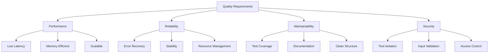

# Quality Requirements

## Quality Scenarios

### Performance

| Scenario | Metric | Response |
|----------|---------|----------|
| Tool execution latency | < 10ms overhead | 95th percentile |
| MCP request handling | < 5ms | 99th percentile |
| Memory overhead | < 10MB per session | Peak usage |
| Connection handling | 100+ concurrent | No degradation |

### Reliability

| Scenario | Expected Response |
|----------|------------------|
| Tool execution failure | Clean error, no resource leaks |
| Network interruption | Graceful connection close |
| Invalid MCP request | Proper error response |
| Resource exhaustion | Controlled shutdown |

### Maintainability

| Aspect | Requirement |
|--------|-------------|
| Code coverage | > 90% |
| Documentation | All public APIs |
| Error handling | Comprehensive |
| Testing | Unit + Integration |

### Security

| Requirement | Implementation |
|-------------|---------------|
| Tool isolation | Per-session context |
| Input validation | Schema-based |
| Access control | Permission system |
| Error exposure | Limited details |

## Quality Tree

## Evaluation Scenarios

### Performance Testing
- Tool execution benchmarks
- Connection handling stress tests
- Memory usage profiling
- Latency measurements

### Reliability Testing
- Error injection testing
- Resource exhaustion tests
- Network failure scenarios
- Long-running stability tests

### Security Testing
- Permission boundary tests
- Input validation fuzzing
- Resource access control
- Error information leakage
