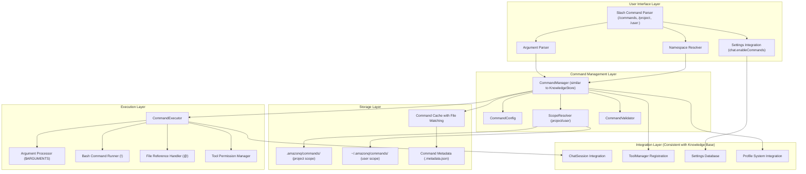
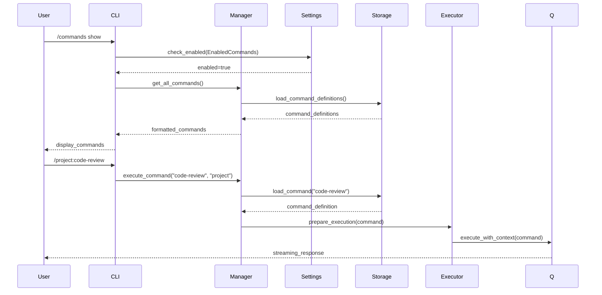

# System Overview - Custom Commands Architecture (Updated for Consistency)

## Executive Summary

The Custom Commands feature extends Amazon Q CLI with user-defined reusable commands, following the established pattern of the knowledge base feature for consistent user experience and implementation patterns.

## System Architecture (Aligned with Knowledge Base)



## Core Components (Following Knowledge Base Patterns)

### 1. Settings Integration (Consistent with Knowledge Base)

**CommandSettings** (mirrors KnowledgeSettings)
```rust
pub enum Setting {
    EnabledCommands,           // chat.enableCommands (like EnabledKnowledge)
    CommandsMaxExecutionTime,  // chat.commands.maxExecutionTime
    CommandsAllowBashExecution, // chat.commands.allowBashExecution
}

impl CommandManager {
    pub fn is_enabled(os: &Os) -> bool {
        os.database
            .settings
            .get_bool(Setting::EnabledCommands)
            .unwrap_or(false)
    }
}
```

### 2. Command Management Layer (Similar to KnowledgeStore)

**CommandManager** (mirrors KnowledgeStore pattern)
```rust
pub struct CommandManager {
    cache: HashMap<String, CommandDefinition>,
    file_watcher: FileWatcher,
}

impl CommandManager {
    pub async fn get_instance() -> Arc<Mutex<Self>> {
        // Singleton pattern like KnowledgeStore
    }
    
    pub async fn add(&mut self, name: &str, scope: CommandScope) -> Result<String, String> {
        // Similar to KnowledgeStore::add
    }
    
    pub async fn remove(&mut self, name: &str, scope: CommandScope) -> Result<(), String> {
        // Similar to KnowledgeStore::remove_by_name
    }
    
    pub async fn get_all(&self) -> Result<Vec<CommandDefinition>, String> {
        // Similar to KnowledgeStore::get_all
    }
    
    pub async fn clear(&mut self, scope: Option<CommandScope>) -> Result<String, String> {
        // Similar to KnowledgeStore::clear with confirmation
    }
}
```

### 3. Tool Registration (Consistent with Knowledge Base)

**Tool Integration** (following knowledge base pattern)
```rust
// In tools/mod.rs
pub enum Tool {
    // ... existing tools
    Knowledge(Knowledge),
    Commands(Commands),  // New tool following same pattern
}

impl Tool {
    pub fn name(&self) -> &str {
        match self {
            Tool::Knowledge(_) => "knowledge",
            Tool::Commands(_) => "commands",
            // ...
        }
    }
    
    pub fn permission_eval(&self) -> PermissionEvalResult {
        match self {
            Tool::Knowledge(_) => PermissionEvalResult::Ask,
            Tool::Commands(_) => PermissionEvalResult::Ask,  // Same security level
            // ...
        }
    }
}

// In tool_manager.rs
if !Commands::is_enabled(os) {
    tool_specs.remove("commands");  // Same pattern as knowledge
}
```

### 4. Storage Strategy (Consistent File Organization)

**File Organization** (mirrors knowledge base structure)
```
~/.amazonq/commands/           # User commands (like knowledge global)
├── command-name.md
├── namespace/
│   └── namespaced-command.md
└── .metadata.json             # Command registry

.amazonq/commands/             # Project commands (like knowledge local)
├── project-specific.md
├── frontend/
│   └── component-review.md
└── .metadata.json
```

**Metadata Structure** (consistent with knowledge base)
```json
{
  "version": "1.0.0",
  "commands": {
    "command-name": {
      "created_at": "2025-07-10T19:00:00Z",
      "updated_at": "2025-07-10T19:00:00Z",
      "usage_count": 15,
      "last_used": "2025-07-10T18:30:00Z",
      "checksum": "abc123..."
    }
  }
}
```

## Integration Points (Consistent with Knowledge Base)

### Settings Database Integration
```rust
// Same pattern as knowledge base
impl CommandManager {
    pub fn is_enabled(os: &Os) -> bool {
        os.database
            .settings
            .get_bool(Setting::EnabledCommands)
            .unwrap_or(false)
    }
}
```

### ChatSession Integration
```rust
// Same integration pattern as knowledge base
impl Commands {
    pub async fn invoke(&self, os: &Os, updates: &mut impl Write) -> Result<InvokeOutput> {
        // Execute within chat session context
        // Follow same streaming response pattern
    }
}
```

### Profile System Integration
```rust
// Consistent with knowledge base profile handling
impl CommandManager {
    pub fn get_profile_commands(&self, profile: &str) -> Vec<CommandDefinition> {
        // Profile-specific command filtering
    }
}
```

## Data Flow (Consistent with Knowledge Base)



## Security Model (Aligned with Knowledge Base)

### Permission System (Consistent Security Level)
```rust
// Same permission evaluation as knowledge base
impl Tool {
    pub fn permission_eval(&self) -> PermissionEvalResult {
        match self {
            Tool::Knowledge(_) => PermissionEvalResult::Ask,
            Tool::Commands(_) => PermissionEvalResult::Ask,  // Same level
        }
    }
}
```

### Command Validation (Enhanced Security)
```rust
pub struct CommandValidator {
    max_size: usize,
    allowed_tools: HashSet<String>,
    bash_execution_enabled: bool,
}

impl CommandValidator {
    pub fn validate(&self, command: &CommandDefinition) -> Result<(), ValidationError> {
        // YAML frontmatter validation
        // Content size limits
        // Tool permission validation
        // Bash execution permission checks
    }
}
```

## Performance Considerations (Consistent with Knowledge Base)

### Caching Strategy (Similar to Knowledge Base)
```rust
pub struct CommandCache {
    commands: HashMap<String, CommandDefinition>,
    file_watcher: FileWatcher,
    last_refresh: Instant,
}

impl CommandCache {
    pub fn refresh_if_needed(&mut self) -> Result<()> {
        // File system watching like knowledge base
        // Lazy loading of command definitions
        // Cache invalidation on file changes
    }
}
```

### Resource Management
- Memory usage optimization (like knowledge base)
- File I/O minimization
- Concurrent execution handling
- Cleanup and garbage collection

## Error Handling (Consistent Patterns)

### Graceful Degradation (Same as Knowledge Base)
```rust
// Feature disabled handling
if !CommandManager::is_enabled(os) {
    return Err(ChatError::FeatureDisabled {
        feature: "Custom Commands",
        setting: "chat.enableCommands",
    });
}

// Command not found handling
if command.is_none() {
    return Ok(InvokeOutput {
        output: OutputKind::Text(format!(
            "❌ Command '{}' not found.\n\nAvailable commands:\n{}",
            name,
            available_commands.join("\n• ")
        )),
    });
}
```

### User Feedback (Consistent Messaging)
- Same error message format as knowledge base
- Consistent progress indicators
- Same confirmation patterns for destructive operations
- Unified help system integration

## Deployment Strategy (Aligned with Knowledge Base)

### Feature Flag Integration
```rust
// Same feature enablement pattern
pub const COMMANDS_FEATURE_ENABLED: bool = cfg!(feature = "commands");

impl ToolManager {
    pub fn register_tools(&mut self, os: &Os) {
        // ... existing tools
        
        if COMMANDS_FEATURE_ENABLED && CommandManager::is_enabled(os) {
            self.register_tool("commands", CommandsTool::new());
        }
    }
}
```

### Migration Strategy
- Gradual rollout following knowledge base pattern
- Settings migration support
- Backward compatibility considerations
- User education and onboarding

---

*Architecture Version: 2.0 - Updated for Knowledge Base Consistency*
*Last Updated: 2025-07-10*
*Changes: Aligned with knowledge base patterns and integration points*
