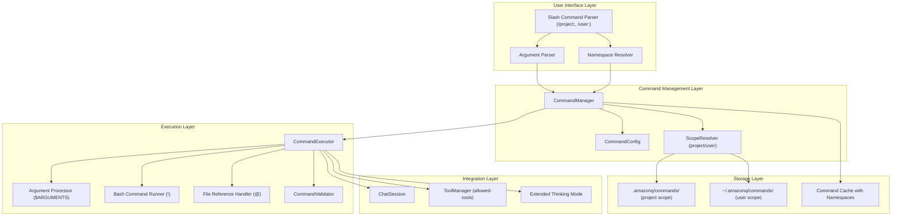
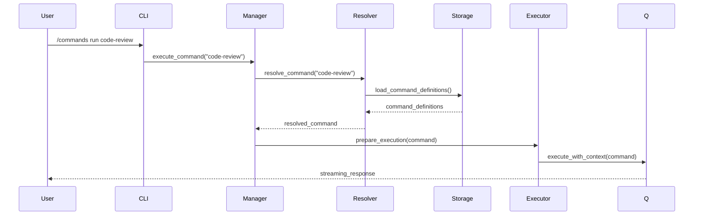

# System Overview - Custom Commands Architecture

## Executive Summary

The Custom Commands feature extends Amazon Q CLI with user-defined reusable commands, following the established pattern of the `/context` command. Users can define commands in Markdown format with structured instructions that Amazon Q can execute.

## System Architecture



## Core Components

### 1. Command Management Layer

**CommandManager**
- Central orchestrator for command operations
- Handles CRUD operations for custom commands
- Manages scope resolution (global vs local)
- Integrates with existing profile system

**CommandConfig**
- Configuration structure for command definitions
- Serializable format for persistence
- Validation rules and constraints

**ScopeResolver**
- Determines command precedence (local overrides global)
- Handles command discovery and loading
- Manages command namespace conflicts

### 2. Storage Strategy

**File Organization**
```
~/.amazonq/commands/           # Global commands
├── command-name.md
├── another-command.md
└── .metadata.json

.amazonq/commands/             # Local commands (project-specific)
├── project-specific.md
├── code-review.md
└── .metadata.json
```

**Metadata Structure**
- Command registration information
- Version tracking
- Usage statistics
- Validation checksums

### 3. Command Execution Flow

1. **Discovery**: Scan global and local command directories
2. **Resolution**: Resolve scope conflicts (local wins)
3. **Validation**: Validate command format and security
4. **Preparation**: Inject context and prepare execution environment
5. **Execution**: Execute command through Amazon Q chat interface
6. **Cleanup**: Handle post-execution cleanup and logging

## Integration Points

### With Existing Systems

**ChatSession Integration**
- Commands execute within existing chat sessions
- Inherit current context and conversation state
- Support for streaming responses

**Profile System Integration**
- Commands can be profile-specific
- Inherit profile context and configuration
- Support for profile-based command overrides

**Context System Integration**
- Commands can reference and modify context
- Support for dynamic context injection
- Integration with existing context hooks

## Data Flow



## Security Considerations

### Command Validation
- Markdown format validation
- Content sanitization
- Size and complexity limits
- Malicious content detection

### Execution Safety
- Sandboxed execution environment
- Resource usage limits
- Timeout mechanisms
- Audit logging

### Access Control
- File system permissions
- Command scope restrictions
- User consent for sensitive operations

## Performance Considerations

### Caching Strategy
- In-memory command cache
- Lazy loading of command definitions
- Cache invalidation on file changes
- Optimized command discovery

### Resource Management
- Memory usage optimization
- File I/O minimization
- Concurrent execution handling
- Cleanup and garbage collection

## Scalability

### Command Organization
- Hierarchical command structure
- Command categorization and tagging
- Search and discovery mechanisms
- Bulk operations support

### Multi-user Support
- User-specific command isolation
- Shared command repositories
- Permission-based access control
- Collaborative command development

## Error Handling

### Graceful Degradation
- Fallback mechanisms for missing commands
- Partial execution recovery
- User-friendly error messages
- Detailed logging for debugging

### Recovery Strategies
- Automatic retry mechanisms
- State restoration capabilities
- Transaction-like command execution
- Rollback support for failed operations

---

*Architecture Version: 1.0*
*Last Updated: 2025-07-06*
*Next Review: Phase 1 Completion*
