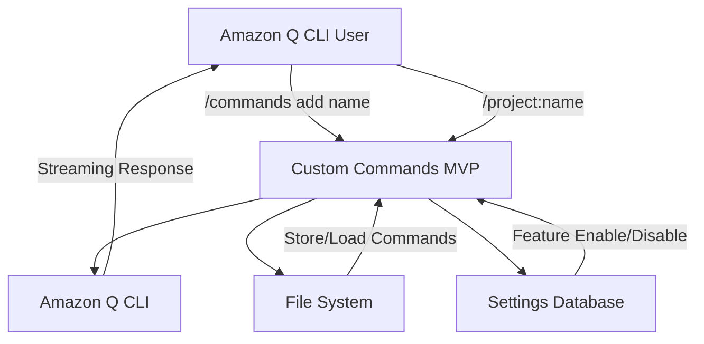
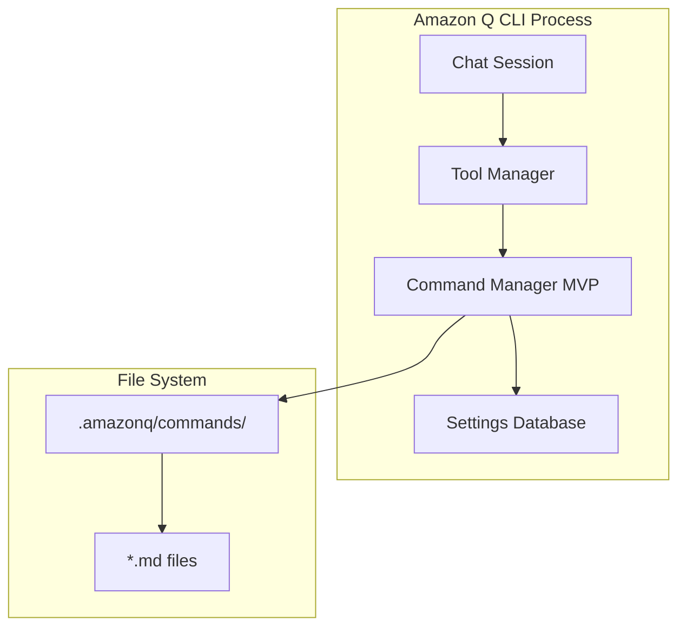
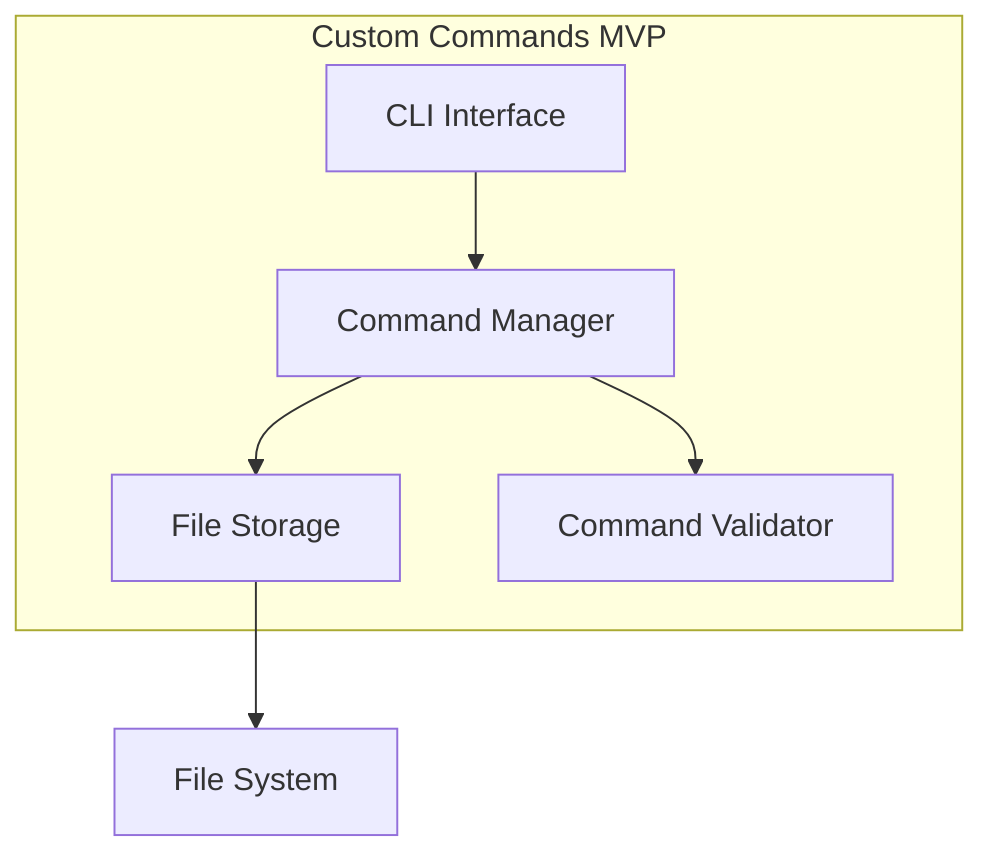
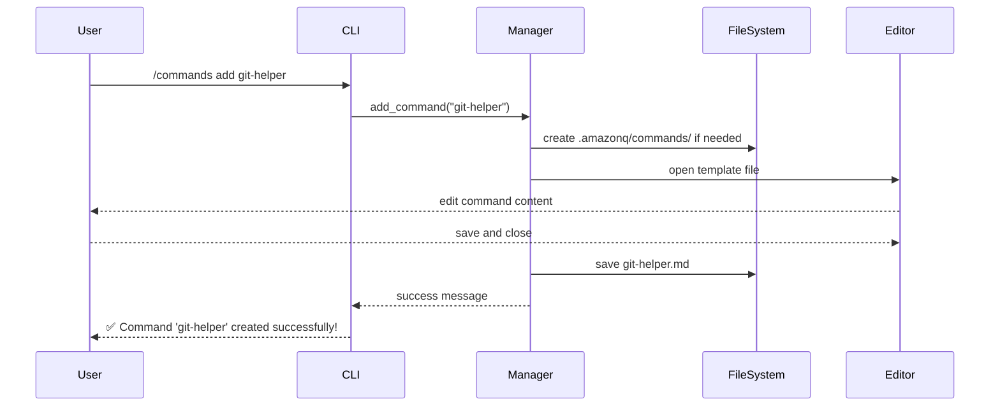
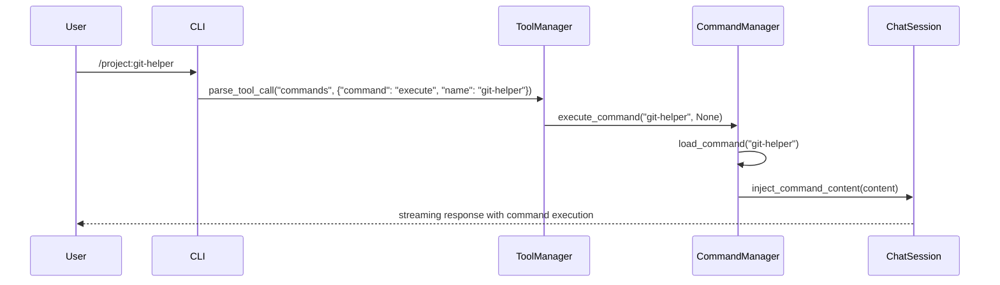
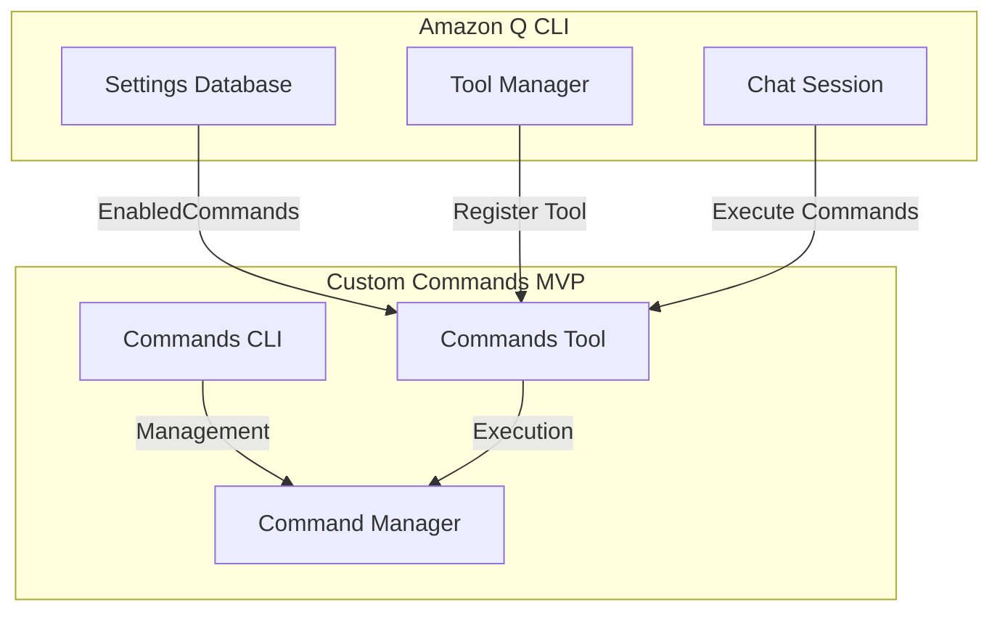

# Custom Commands MVP - arc42 Architecture Documentation

## 1. Introduction and Goals

### 1.1 Requirements Overview

**MVP Scope**: Implement the minimal viable product for custom commands with two core features:
1. **`/commands add <name>`** - Create a new custom command
2. **`/project:<name>`** - Execute a project-scoped custom command

### 1.2 Quality Goals

| Priority | Quality Goal | Scenario |
|----------|-------------|----------|
| 1 | **Consistency** | MVP follows exact knowledge base UX patterns |
| 2 | **Security** | Commands execute with proper validation and user consent |
| 3 | **Simplicity** | Minimal feature set that demonstrates core value |
| 4 | **Reliability** | Error handling and graceful degradation |

### 1.3 Stakeholders

| Role | Contact | Expectations |
|------|---------|-------------|
| Developer | Implementation Team | Clean, maintainable code following established patterns |
| End User | Amazon Q CLI Users | Intuitive interface consistent with existing features |
| Product Owner | Amazon Q Team | Demonstrable value with minimal complexity |

## 2. Architecture Constraints

### 2.1 Technical Constraints

| Constraint | Background |
|------------|------------|
| **Rust Language** | Must integrate with existing Amazon Q CLI codebase |
| **Knowledge Base Patterns** | Must follow exact UX and implementation patterns |
| **File-based Storage** | Commands stored as Markdown files in `.amazonq/commands/` |
| **Settings Integration** | Feature gated behind `chat.enableCommands` setting |

### 2.2 Organizational Constraints

| Constraint | Background |
|------------|------------|
| **MVP Timeline** | 2-3 weeks maximum development time |
| **Pattern Consistency** | Must not deviate from knowledge base patterns |
| **Security Requirements** | Same security level as knowledge base feature |

## 3. System Scope and Context

### 3.1 Business Context



### 3.2 Technical Context



## 4. Solution Strategy

### 4.1 MVP Architecture Approach

**Follow Knowledge Base Pattern Exactly:**
1. **Settings Integration** - Reuse `Setting` enum pattern
2. **Tool Registration** - Same tool registration as knowledge base
3. **CLI Structure** - Mirror `/knowledge` command structure
4. **File Operations** - Use existing `Os` abstraction
5. **Error Handling** - Consistent error messages and patterns

### 4.2 Technology Decisions

| Decision | Rationale |
|----------|-----------|
| **Markdown Files** | Human-readable, version-control friendly |
| **Project Scope Only** | Simplify MVP by focusing on `.amazonq/commands/` |
| **No YAML Frontmatter** | Reduce complexity for MVP |
| **Basic Validation** | Essential security without advanced features |
| **Synchronous Operations** | Avoid async complexity for MVP |

## 5. Building Block View

### 5.1 Level 1: System Overview



### 5.2 Level 2: Component Details

#### 5.2.1 CLI Interface
```rust
// File: crates/chat-cli/src/cli/chat/cli/commands.rs
#[derive(Clone, Debug, PartialEq, Eq, Subcommand)]
pub enum CommandsSubcommand {
    /// Add a new custom command
    Add { name: String },
}

// File: crates/chat-cli/src/cli/chat/tools/commands.rs
#[derive(Debug, Clone, Deserialize)]
#[serde(tag = "command", rename_all = "lowercase")]
pub enum Commands {
    Execute(CommandExecute),
}

#[derive(Debug, Clone, Deserialize)]
pub struct CommandExecute {
    pub name: String,
    pub args: Option<String>,
}
```

#### 5.2.2 Command Manager
```rust
// File: crates/chat-cli/src/util/command_manager.rs
pub struct CommandManager {
    project_path: PathBuf,
    cache: HashMap<String, CustomCommand>,
}

impl CommandManager {
    pub fn new(os: &Os) -> Result<Self, CommandError>;
    pub fn add_command(&mut self, name: &str) -> Result<String, CommandError>;
    pub fn get_command(&self, name: &str) -> Option<&CustomCommand>;
    pub fn execute_command(&self, name: &str, args: Option<&str>) -> Result<String, CommandError>;
}
```

#### 5.2.3 Data Structures
```rust
// File: crates/chat-cli/src/util/command_types.rs
#[derive(Debug, Clone)]
pub struct CustomCommand {
    pub name: String,
    pub content: String,
    pub created_at: DateTime<Utc>,
}

#[derive(Debug, thiserror::Error)]
pub enum CommandError {
    #[error("Command '{0}' not found")]
    NotFound(String),
    #[error("IO error: {0}")]
    Io(#[from] std::io::Error),
    #[error("Invalid command format: {0}")]
    InvalidFormat(String),
}
```

## 6. Runtime View

### 6.1 Command Creation Flow



### 6.2 Command Execution Flow



## 7. Deployment View

### 7.1 File Structure

```
.amazonq/
└── commands/           # Project-scoped commands only (MVP)
    ├── git-helper.md   # Example command file
    ├── code-review.md  # Example command file
    └── .metadata.json  # Command metadata (optional for MVP)
```

### 7.2 Integration Points



## 8. Cross-cutting Concepts

### 8.1 Security

**MVP Security Model:**
- Feature disabled by default (`chat.enableCommands false`)
- Basic content validation (file size, format)
- User consent for command execution (same as knowledge base)
- No bash execution or file references in MVP

### 8.2 Error Handling

**Consistent Error Patterns:**
```rust
// Feature disabled
"❌ Commands tool is disabled. Enable it with: q settings chat.enableCommands true"

// Command not found
"❌ Command 'git-helper' not found in project scope.\n\nUse '/commands add git-helper' to create it."

// File system errors
"❌ Failed to create command: Permission denied"
```

### 8.3 Logging and Monitoring

**MVP Logging:**
- Command creation events
- Command execution events
- Error conditions
- Performance metrics (basic)

## 9. Architecture Decisions

### 9.1 ADR-MVP-001: Project Scope Only

**Status**: Accepted  
**Decision**: MVP only supports project-scoped commands (`.amazonq/commands/`)  
**Rationale**: Reduces complexity, focuses on core value proposition  
**Consequences**: Users can only create project-specific commands in MVP  

### 9.2 ADR-MVP-002: No YAML Frontmatter

**Status**: Accepted  
**Decision**: MVP uses plain Markdown without YAML frontmatter  
**Rationale**: Simplifies parsing and validation for MVP  
**Consequences**: No tool permissions or metadata in MVP  

### 9.3 ADR-MVP-003: Synchronous Operations

**Status**: Accepted  
**Decision**: All operations are synchronous in MVP  
**Rationale**: Avoids async complexity, faster development  
**Consequences**: No background operations or progress tracking  

## 10. Quality Requirements

### 10.1 Performance

| Requirement | Target | Measurement |
|-------------|--------|-------------|
| Command Creation | < 2 seconds | Time from `/commands add` to editor open |
| Command Execution | < 1 second | Time from `/project:name` to response start |
| File Loading | < 100ms | Time to load command from disk |

### 10.2 Reliability

| Requirement | Target | Measurement |
|-------------|--------|-------------|
| Error Handling | 100% | All error conditions have user-friendly messages |
| Data Integrity | 100% | Commands are not corrupted during creation/editing |
| Graceful Degradation | 100% | Feature disabled state handled gracefully |

## 11. Risks and Technical Debts

### 11.1 Technical Risks

| Risk | Probability | Impact | Mitigation |
|------|-------------|--------|------------|
| **Pattern Inconsistency** | Medium | High | Strict adherence to knowledge base patterns |
| **File System Permissions** | Low | Medium | Proper error handling and user feedback |
| **Editor Integration** | Medium | Medium | Fallback to simple text creation |

### 11.2 Technical Debt

| Debt | Impact | Payback Strategy |
|------|--------|------------------|
| **No User Scope** | Medium | Add in Phase 2 of full implementation |
| **No YAML Frontmatter** | Medium | Add metadata support in Phase 2 |
| **No Advanced Features** | Low | Add bash execution, file references in Phase 2 |

## 12. Glossary

| Term | Definition |
|------|------------|
| **Custom Command** | User-defined reusable instruction template stored as Markdown |
| **Project Scope** | Commands stored in `.amazonq/commands/` directory |
| **Command Execution** | Process of injecting command content into chat session |
| **Tool Registration** | Integration with Amazon Q's tool management system |
| **Knowledge Base Pattern** | Established UX and implementation patterns from `/knowledge` feature |

---

*Document Version: 1.0*  
*Created: 2025-07-10*  
*Status: MVP Specification*  
*Next Review: After MVP Implementation*
