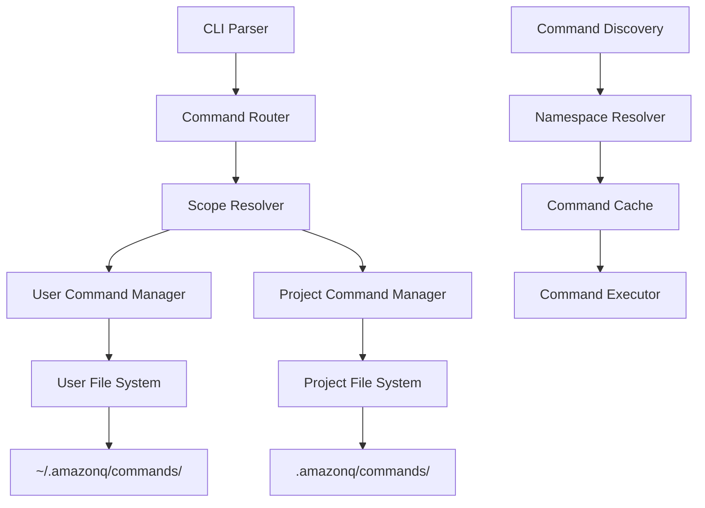

# User-Scoped Commands Design

## Overview

This design extends the existing custom commands system to support user-scoped commands stored in `~/.amazonq/commands/`. The implementation builds upon the existing MVP foundation while adding user scope support, namespace resolution, and enhanced command management capabilities.

## Architecture

### System Components



### Integration with Existing System

The user-scoped commands feature integrates with the existing MVP implementation by:

1. **Extending CommandScope enum** - Adding `User` variant alongside existing `Project`
2. **Enhancing Command Router** - Adding `/user:` syntax parsing
3. **Expanding Command Manager** - Supporting dual-scope command resolution
4. **Reusing Core Infrastructure** - Leveraging existing file operations, validation, and execution

## Components and Interfaces

### Enhanced Command Scope

```rust
#[derive(Debug, Clone, Serialize, Deserialize, PartialEq)]
pub enum CommandScope {
    Project, // .amazonq/commands/ - /project: prefix (existing)
    User,    // ~/.amazonq/commands/ - /user: prefix (new)
}

impl CommandScope {
    pub fn directory_path(&self, os: &Os) -> Result<PathBuf, CommandError> {
        match self {
            CommandScope::Project => os.current_dir()?.join(".amazonq/commands"),
            CommandScope::User => os.home_dir()?.join(".amazonq/commands"),
        }
    }
    
    pub fn execution_prefix(&self) -> &'static str {
        match self {
            CommandScope::Project => "/project:",
            CommandScope::User => "/user:",
        }
    }
}
```

### Command Router Enhancement

```rust
pub struct CommandRouter {
    project_manager: CommandManager,
    user_manager: CommandManager,
}

impl CommandRouter {
    pub fn parse_command_input(&self, input: &str) -> Result<CommandInput, CommandError> {
        if let Some(command_name) = input.strip_prefix("/project:") {
            return Ok(CommandInput::Execute {
                scope: CommandScope::Project,
                name: command_name.to_string(),
            });
        }
        
        if let Some(command_name) = input.strip_prefix("/user:") {
            return Ok(CommandInput::Execute {
                scope: CommandScope::User,
                name: command_name.to_string(),
            });
        }
        
        // Handle management commands (/commands ...)
        if input.starts_with("/commands ") {
            return self.parse_management_command(input);
        }
        
        Err(CommandError::InvalidSyntax)
    }
}
```

### Dual-Scope Command Manager

```rust
pub struct DualScopeCommandManager {
    user_manager: CommandManager,
    project_manager: CommandManager,
    namespace_resolver: NamespaceResolver,
}

impl DualScopeCommandManager {
    pub async fn resolve_command(&self, scope: CommandScope, name: &str) -> Result<CustomCommand, CommandError> {
        match scope {
            CommandScope::User => self.user_manager.get_command(name).await,
            CommandScope::Project => self.project_manager.get_command(name).await,
        }
    }
    
    pub async fn list_all_commands(&self) -> Result<Vec<CommandInfo>, CommandError> {
        let mut commands = Vec::new();
        
        // Get user commands
        let user_commands = self.user_manager.list_commands().await?;
        commands.extend(user_commands.into_iter().map(|cmd| CommandInfo {
            scope: CommandScope::User,
            command: cmd,
        }));
        
        // Get project commands
        let project_commands = self.project_manager.list_commands().await?;
        commands.extend(project_commands.into_iter().map(|cmd| CommandInfo {
            scope: CommandScope::Project,
            command: cmd,
        }));
        
        Ok(commands)
    }
}
```

### Namespace Resolution

```rust
pub struct NamespaceResolver;

impl NamespaceResolver {
    /// Extract namespace from file path relative to commands directory
    /// e.g., "git/helper.md" → Some("git")
    /// e.g., "frontend/components/button.md" → Some("frontend:components")
    pub fn extract_namespace(&self, relative_path: &Path) -> Option<String> {
        let parent = relative_path.parent()?;
        if parent == Path::new("") {
            return None;
        }
        
        Some(parent.components()
            .map(|c| c.as_os_str().to_string_lossy())
            .collect::<Vec<_>>()
            .join(":"))
    }
    
    /// Generate full command identifier for execution
    /// e.g., (User, Some("git"), "helper") → "/user:git:helper"
    pub fn generate_execution_syntax(&self, scope: CommandScope, namespace: Option<&str>, name: &str) -> String {
        let prefix = scope.execution_prefix();
        match namespace {
            Some(ns) => format!("{}{}:{}", prefix, ns, name),
            None => format!("{}{}", prefix, name),
        }
    }
}
```

## Data Models

### Enhanced Command Structure

```rust
#[derive(Debug, Clone, Serialize, Deserialize)]
pub struct CustomCommand {
    pub name: String,
    pub namespace: Option<String>,
    pub scope: CommandScope,
    pub file_path: PathBuf,
    pub content: String,
    pub metadata: CommandMetadata,
    pub created_at: DateTime<Utc>,
    pub modified_at: DateTime<Utc>,
}

#[derive(Debug, Clone, Serialize, Deserialize)]
pub struct CommandInfo {
    pub scope: CommandScope,
    pub command: CustomCommand,
}

#[derive(Debug, Clone, Serialize, Deserialize)]
pub struct CommandMetadata {
    pub description: Option<String>,
    pub tags: Vec<String>,
    pub usage_count: u64,
    pub last_used: Option<DateTime<Utc>>,
}
```

### CLI Command Structure

```rust
#[derive(Debug, PartialEq, Subcommand)]
pub enum CommandsSubcommand {
    Add {
        name: String,
        #[arg(long, value_enum, default_value = "project")]
        scope: CommandScope,
        #[arg(long)]
        namespace: Option<String>,
    },
    Show {
        #[arg(long, value_enum)]
        scope: Option<CommandScope>,
        #[arg(long)]
        namespace: Option<String>,
        #[arg(long)]
        expand: bool,
    },
    Remove {
        name: String,
        #[arg(long, value_enum)]
        scope: Option<CommandScope>,
    },
    List {
        #[arg(long, value_enum)]
        scope: Option<CommandScope>,
        #[arg(long)]
        namespace: Option<String>,
    },
}
```

## Error Handling

### Enhanced Error Types

```rust
#[derive(Debug, thiserror::Error)]
pub enum CommandError {
    #[error("Command '{name}' not found in {scope} scope.\n\nUse '/commands add {name} --scope {scope_arg}' to create it.")]
    CommandNotFound {
        name: String,
        scope: CommandScope,
        scope_arg: String,
    },
    
    #[error("User commands directory not accessible: {path}\n\nEnsure you have proper permissions to access your home directory.")]
    UserDirectoryInaccessible { path: PathBuf },
    
    #[error("Invalid namespace '{namespace}'. Namespaces can only contain alphanumeric characters, hyphens, and underscores.")]
    InvalidNamespace { namespace: String },
    
    #[error("Commands tool is disabled. Enable it with: q settings chat.enableCommands true")]
    FeatureDisabled,
    
    // ... existing error variants
}
```

## Testing Strategy

### Unit Tests

```rust
#[cfg(test)]
mod tests {
    use super::*;
    use tempfile::TempDir;
    
    #[tokio::test]
    async fn test_user_command_creation() {
        let temp_dir = TempDir::new().unwrap();
        let user_home = temp_dir.path();
        
        let manager = CommandManager::new(CommandScope::User, user_home);
        let result = manager.create_command("test-command", None).await;
        
        assert!(result.is_ok());
        assert!(user_home.join(".amazonq/commands/test-command.md").exists());
    }
    
    #[tokio::test]
    async fn test_namespace_resolution() {
        let resolver = NamespaceResolver;
        
        let namespace = resolver.extract_namespace(Path::new("git/helper.md"));
        assert_eq!(namespace, Some("git".to_string()));
        
        let namespace = resolver.extract_namespace(Path::new("frontend/components/button.md"));
        assert_eq!(namespace, Some("frontend:components".to_string()));
        
        let namespace = resolver.extract_namespace(Path::new("simple.md"));
        assert_eq!(namespace, None);
    }
    
    #[tokio::test]
    async fn test_command_scope_priority() {
        // Test that project commands take priority over user commands
        // when both exist with the same name
    }
}
```

### Integration Tests

```rust
#[cfg(test)]
mod integration_tests {
    use super::*;
    
    #[tokio::test]
    async fn test_user_command_execution_flow() {
        // Test complete flow from command creation to execution
        // 1. Create user command
        // 2. Execute via /user:command syntax
        // 3. Verify content injection and AI processing
    }
    
    #[tokio::test]
    async fn test_cross_platform_paths() {
        // Test that user command paths work correctly on different platforms
    }
}
```

### Manual Testing Scenarios

1. **User Command Creation**
   ```bash
   /commands add git-helper --scope user
   # Should create ~/.amazonq/commands/git-helper.md
   ```

2. **Namespace Command Creation**
   ```bash
   /commands add component --scope user --namespace frontend
   # Should create ~/.amazonq/commands/frontend/component.md
   ```

3. **User Command Execution**
   ```bash
   /user:git-helper
   # Should execute user-scoped command
   ```

4. **Command Listing**
   ```bash
   /commands show
   # Should show both user and project commands with scope indicators
   ```

## Security Considerations

### File System Security

1. **Home Directory Access** - Validate user has proper permissions to access home directory
2. **Path Traversal Prevention** - Sanitize namespace and command names to prevent directory traversal
3. **File Permissions** - Create user command files with appropriate permissions (readable by user only)

### Command Execution Security

1. **Scope Isolation** - Ensure user commands cannot access project-specific resources unless explicitly allowed
2. **Namespace Validation** - Validate namespace names to prevent injection attacks
3. **Error Message Safety** - Avoid exposing sensitive file system information in error messages

## Performance Considerations

### Caching Strategy

```rust
pub struct CommandCache {
    user_commands: HashMap<String, CustomCommand>,
    project_commands: HashMap<String, CustomCommand>,
    last_refresh: HashMap<CommandScope, Instant>,
    cache_ttl: Duration,
}

impl CommandCache {
    pub async fn get_command(&mut self, scope: CommandScope, name: &str) -> Option<&CustomCommand> {
        if self.should_refresh(scope) {
            self.refresh_scope(scope).await;
        }
        
        match scope {
            CommandScope::User => self.user_commands.get(name),
            CommandScope::Project => self.project_commands.get(name),
        }
    }
}
```

### File System Optimization

1. **Lazy Loading** - Only load command content when needed for execution
2. **Directory Watching** - Use file system events to invalidate cache when commands change
3. **Batch Operations** - Optimize command discovery by batching file system operations

## Migration Strategy

### Backward Compatibility

The implementation maintains full backward compatibility with the existing MVP:

1. **Existing Commands** - All existing project commands continue to work unchanged
2. **CLI Interface** - Existing `/commands add` and `/project:` syntax remains functional
3. **Settings** - Same `chat.enableCommands` setting controls both scopes

### Gradual Rollout

1. **Phase 1** - Add user scope support without breaking existing functionality
2. **Phase 2** - Enhance management commands with scope filtering
3. **Phase 3** - Add namespace support and advanced features

## Deployment Considerations

### Configuration

No additional configuration required - the feature uses existing settings and extends current behavior.

### Monitoring

1. **Usage Metrics** - Track user vs project command usage patterns
2. **Error Rates** - Monitor file system access errors for user commands
3. **Performance** - Track command discovery and execution times across scopes